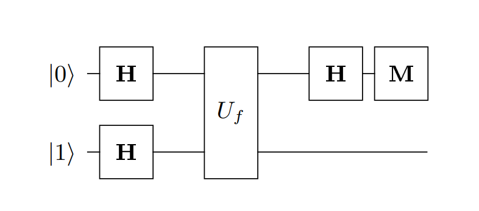

# QuantumDeutschAlgorithm
Implementation of Deutsch Algorithm on Q#



## Install
1. Install Microsoft Quantum Development Kit
2. Install latest .Net

## Build / Run

### Linux / MacOS
```
make run
```

### Windows
```
dotnet run
```

## Results

```
f(x) = 0   | Zero
f(x) = 1   | Zero
f(x) = x   | One
f(x) = !x  | One
```